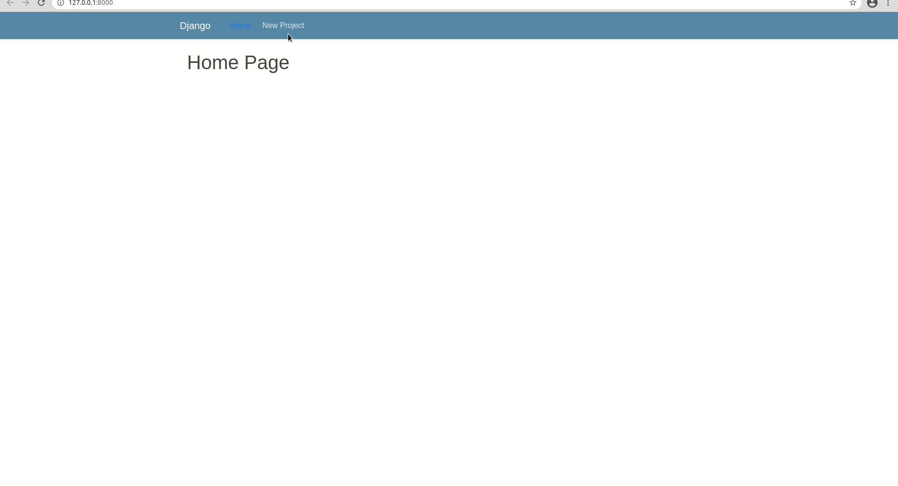

# Project & Task Handler    
A django webapp has been created to manage the list of Projects and Tasks for each Project. The web used the sqlite database to store all the information regarding Projects and Tasks and they are further managed using django ORM (Object-Relational Mapper). 

## Description: 
The following functionality are avaliable in a given web app- 
1. Create new Projects
2. View project details
3. Update and Delete existing projects.
4. Create new Tasks inside each projects.
5. View task details
6. Update and Delete existing Tasks

The the data feom above fuctions stored in the database and managed using ORM

## Front_End: 
HTML, Crispy-Forms

## Back_End: 
Python, Django 

## Database 
sqlite3

## Libraries_used: 
django , django-crispy-forms 

## RUN: 

1. Clone the repo
2. Create conda create environment
3. pip install -r requirement.txt
4. Change to Assignment1
5. python manage.py runserver

## Demo:  

